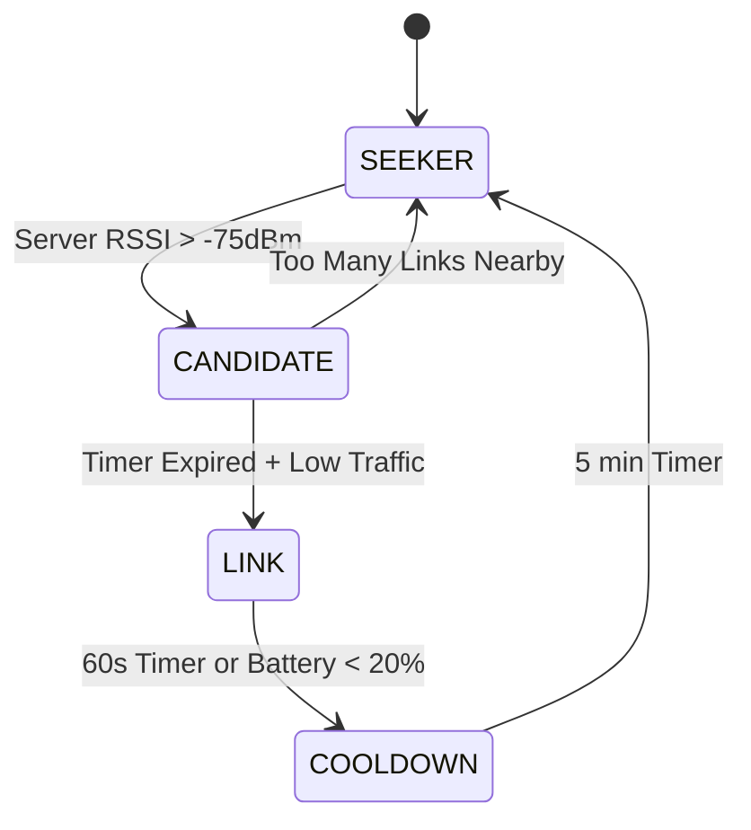

# 🔥 Nodus App - Firefly Swarm Evaluation System

> **Decentralized, Offline-First Evaluation Platform for High-Density Events**

[](https://dotnet.microsoft.com/)
[](https://dotnet.microsoft.com/apps/maui)
[](https://dotnet.microsoft.com/apps/aspnet/web-apps/blazor)
[](LICENSE)

---

## 📋 Table of Contents

- [Overview](#-overview)
- [Architecture](#-architecture)
- [Features](#-features)
- [Tech Stack](#-tech-stack)
- [Getting Started](#-getting-started)
- [Project Structure](#-project-structure)
- [Documentation](#-documentation)
- [Roadmap](#-roadmap)

---

## 🎯 Overview

**Nodus** is a revolutionary evaluation system designed for hackathons, science fairs, and high-density events where traditional Wi-Fi infrastructure fails. Using the innovative **"Firefly Swarm Protocol"**, Nodus creates a self-healing mesh network over Bluetooth Low Energy (BLE) that adapts to crowd movement and conserves battery.

### The Problem

- **500+ devices** in a room saturate Wi-Fi
- **Battery anxiety** prevents users from helping others
- **OS limitations** kill background processes
- **Offline scenarios** require robust local-first solutions

### The Solution

Nodus transforms the audience into a **dynamic, breathing network** where devices:

- 🔥 **Light up** briefly as relays when needed
- 💤 **Sleep** most of the time to save battery
- 🔄 **Rotate roles** to distribute load
- 🛡️ **Self-heal** when people move around

---

## 🏗️ Architecture

### System Components

```
┌─────────────────────────────────────────────────────────┐
│                    Nodus Ecosystem                      │
├─────────────────────────────────────────────────────────┤
│                                                         │
│  ┌──────────────┐  ┌──────────────┐  ┌──────────────┐ │
│  │ Nodus.Client │  │ Nodus.Server │  │  Nodus.Web   │ │
│  │   (Judge)    │  │   (Admin)    │  │  (Student)   │ │
│  │  Android/iOS │  │   Windows    │  │   Browser    │ │
│  └──────┬───────┘  └──────┬───────┘  └──────┬───────┘ │
│         │                  │                  │         │
│         └──────────────────┴──────────────────┘         │
│                           │                             │
│                  ┌────────▼────────┐                    │
│                  │  Nodus.Shared   │                    │
│                  │  (Core Logic)   │                    │
│                  └─────────────────┘                    │
└─────────────────────────────────────────────────────────┘
```

### Firefly Protocol States



### Network Topology

```
        [Server/Admin]
             ▲
             │
      ┌──────┼──────┐
      │      │      │
   [Link] [Link] [Link]  ← Dynamic relays (60s TTL)
      │      │      │
   ┌──┴──┐ ┌┴──┐ ┌─┴──┐
 [Judge][Judge][Judge]  ← Seekers voting
```

---

## ✨ Features

### 🎯 Core Features

- ✅ **Offline-First:** SQLite local database, sync when possible
- ✅ **Dynamic Mesh:** Self-organizing BLE network
- ✅ **Battery Efficient:** Nodes sleep 90% of the time
- ✅ **Secure:** Ed25519 signatures + AES-GCM encryption
- ✅ **Anti-Replay:** Bloom filter prevents duplicate packets
- ✅ **QR-Based:** Fast project identification via QR codes

### 📱 Nodus.Client (Judge App)

- ✅ Scan project QR codes
- ✅ Evaluate projects with custom rubrics
- ✅ Offline voting with local persistence
- ✅ Automatic sync via BLE mesh
- ✅ Photo/audio attachments (Wi-Fi sync)
- ✅ Real-time network status

### 💻 Nodus.Server (Admin Dashboard)

- ✅ Create events and rubrics
- ✅ Monitor network topology
- ✅ Real-time vote aggregation
- ✅ Export results (CSV/Excel)
- ✅ BLE GATT server
- ✅ Telemetry dashboard

### 🌐 Nodus.Web (Student Portal)

- ✅ **NEW:** Project registration
- ✅ **NEW:** QR code generation
- ✅ **NEW:** Fullscreen display mode
- 🔄 Live project updates
- 🔄 Team member management

---

## 🛠️ Tech Stack

### Frameworks

| Technology      | Version | Purpose           |
| :-------------- | :------ | :---------------- |
| **.NET**        | 10.0    | Runtime           |
| **MAUI**        | Latest  | Cross-platform UI |
| **Blazor WASM** | 10.0    | Web frontend      |
| **SQLite**      | Latest  | Local database    |

### Key Libraries

| Package                       | Purpose                            |
| :---------------------------- | :--------------------------------- |
| `Shiny.BluetoothLE`           | BLE driver with background support |
| `Shiny.BluetoothLE.Hosting`   | GATT server for relays             |
| `sqlite-net-pcl`              | Fast ORM for mobile                |
| `CommunityToolkit.Mvvm`       | MVVM helpers                       |
| `QRCoder`                     | QR code generation                 |
| `BarcodeScanning.Native.Maui` | QR scanner (ML Kit)                |

### Architecture Pattern

**MVVM + Clean Architecture**

```
Services/          # Business logic
ViewModels/        # Presentation + Commands
Views/             # UI (XAML/Razor)
Models/            # DTOs
Abstractions/      # Interfaces
```

---

## 🚀 Getting Started

### Prerequisites

- **Visual Studio 2026** (Preview) or **VS Code** with C# Dev Kit
- **.NET 10 SDK** (Preview)
- **Android Device** (physical, emulator doesn't support BLE)
- **Windows PC** with Bluetooth 5.0+

### Installation

1. **Clone the repository:**

   ```bash
   git clone https://github.com/yourusername/nodusApp.git
   cd nodusApp
   ```

2. **Restore dependencies:**

   ```bash
   cd src
   dotnet restore
   ```

3. **Run the Server (Windows):**

   ```bash
   dotnet run --project Nodus.Server/Nodus.Server.csproj -f net10.0-windows10.0.19041.0
   ```

4. **Run the Client (Android):**

   ```bash
   # Connect Android device via USB
   adb devices
   dotnet run --project Nodus.Client/Nodus.Client.csproj -f net10.0-android
   ```

5. **Run the Web App:**
   ```bash
   dotnet run --project Nodus.Web/Nodus.Web.csproj
   # Navigate to http://localhost:5000
   ```

### Quick Start Guide

1. **Admin Setup:**
   - Launch `Nodus.Server` on Windows laptop
   - Create a new event
   - Generate event QR code
   - Start BLE advertising

2. **Judge Setup:**
   - Install `Nodus.Client` on Android/iOS
   - Scan event QR code
   - Enter event password
   - Start evaluating projects

3. **Student Setup:**
   - Open `Nodus.Web` in browser
   - Register project
   - Display QR code at booth
   - Wait for judges to scan

---

## 📁 Project Structure

```
nodusApp/
├── src/
│   ├── Nodus.Client/          # Judge mobile app
│   │   ├── Services/
│   │   │   ├── BleClientService.cs      # BLE client with retry
│   │   │   ├── RelayHostingService.cs   # GATT server for relay
│   │   │   └── SwarmService.cs          # Firefly FSM
│   │   ├── ViewModels/
│   │   ├── Views/
│   │   └── MauiProgram.cs
│   │
│   ├── Nodus.Server/          # Admin dashboard
│   │   ├── Services/
│   │   │   ├── BleServerService.cs      # GATT server
│   │   │   └── VoteAggregatorService.cs # Vote processing
│   │   ├── ViewModels/
│   │   ├── Views/
│   │   └── MauiProgram.cs
│   │
│   ├── Nodus.Shared/          # Core logic
│   │   ├── Models/
│   │   │   ├── Event.cs
│   │   │   ├── Project.cs
│   │   │   └── Vote.cs
│   │   ├── Protocol/
│   │   │   ├── NodusPacket.cs
│   │   │   ├── ChunkAssembler.cs
│   │   │   └── PacketTracker.cs
│   │   ├── Security/
│   │   │   └── CryptoHelper.cs
│   │   └── Services/
│   │       └── DatabaseService.cs
│   │
│   └── Nodus.Web/             # Student portal
│       ├── Pages/
│       │   ├── Registration.razor       # Project registration
│       │   └── ProjectDisplay.razor     # QR display
│       ├── Services/
│       │   ├── ProjectService.cs        # Project management
│       │   └── QrGeneratorService.cs    # QR generation
│       └── Program.cs
│
├── docs/                      # Technical documentation
│   ├── 01.Architecture.Vision.md
│   ├── 02.Network.Swarm_Protocol.md
│   ├── 03.Data.Offline_First.md
│   ├── 04.Security.Identity.md
│   ├── 16.Architecture.Current_State_Analysis.md
│   ├── 17.Architecture.Development_Roadmap.md
│   └── 18.Summary.Analysis_and_Development.md
│
├── tests/                     # Unit & integration tests
│   ├── Nodus.Tests.Unit/
│   └── Nodus.Tests.Integration/
│
└── execution_guide.md         # Quick execution guide
```

---

## 📚 Documentation

### Core Documentation

1. **[Architecture Vision](docs/01.Architecture.Vision.md)** - System overview
2. **[Swarm Protocol](docs/02.Network.Swarm_Protocol.md)** - Firefly algorithm
3. **[Offline-First Strategy](docs/03.Data.Offline_First.md)** - Data architecture
4. **[Security & Identity](docs/04.Security.Identity.md)** - Crypto design
5. **[Tech Stack](docs/05.Tech_Stack.NET10.md)** - Technologies used

### Recent Analysis

6. **[Current State Analysis](docs/16.Architecture.Current_State_Analysis.md)** - Comprehensive review
7. **[Development Roadmap](docs/17.Architecture.Development_Roadmap.md)** - 4-phase plan
8. **[Summary](docs/18.Summary.Analysis_and_Development.md)** - Executive summary

---

## 🗺️ Roadmap

### ✅ Phase 1: Core Infrastructure (COMPLETED)

- ✅ Firefly Swarm Protocol
- ✅ BLE Client/Server services
- ✅ SQLite offline database
- ✅ Crypto security (Ed25519 + AES-GCM)
- ✅ Judge voting UI
- ✅ Admin dashboard
- ✅ **Student registration portal**

### 🔄 Phase 2: Media Sync (IN PROGRESS)

- 🔄 Image compression service
- 🔄 Supabase Storage integration
- 🔄 Background sync jobs
- 🔄 Wi-Fi detection

### 📋 Phase 3: Testing (PLANNED)

- ⏳ Unit tests (70% coverage target)
- ⏳ Integration tests
- ⏳ BLE simulation (10+ devices)
- ⏳ Load testing

### 📊 Phase 4: Observability (PLANNED)

- ⏳ Real-time topology dashboard
- ⏳ Network metrics (RSSI, latency)
- ⏳ Packet loss tracking
- ⏳ Battery monitoring

### 🚀 Phase 5: Deployment (PLANNED)

- ⏳ CI/CD pipeline (GitHub Actions)
- ⏳ Code signing (Android/iOS)
- ⏳ App Store deployment
- ⏳ User documentation

---

## 📊 Current Status

| Component         | Completion | Status                | Build Status       |
| :---------------- | :--------- | :-------------------- | :----------------- |
| **Nodus.Client**  | 95%        | ✅ Production Ready   | ✅ All Platforms   |
| **Nodus.Server**  | 90%        | ✅ Production Ready   | ✅ All Platforms   |
| **Nodus.Shared**  | 100%       | ✅ Complete           | ✅ All Platforms   |
| **Nodus.Web**     | 70%        | 🟡 Core Features Done | ✅ Blazor WASM     |
| **Media Sync**    | 80%        | 🟡 Implemented        | ✅ Working         |
| **Testing**       | 15%        | 🟡 Basic Tests        | ✅ 3 Test Suites   |
| **Observability** | 30%        | 🟡 Basic Logging      | ✅ Structured Logs |

**Overall Progress:** ~85% Complete

### Recent Fixes (2026-02-10)

✅ **Critical compilation error fixed** - BleServerService duplicate methods removed  
✅ **Dead code eliminated** - Class1.cs and UnitTest1.cs removed  
✅ **DI duplication corrected** - BleClientService registered only once  
✅ **All platforms compiling successfully** - Android, iOS, Windows, macOS

### Known Issues

🟡 **~35 warnings** - Mostly nullability warnings (non-blocking)  
🟡 **Test coverage low** - Only 15% (target: 70%+)  
🟡 **Nodus.Web not using Nodus.Shared** - Needs integration  
🟡 **Export functionality missing** - CSV/Excel export not implemented

---

## 🤝 Contributing

We welcome contributions! Please see our [Contributing Guide](CONTRIBUTING.md) for details.

### Development Workflow

1. Fork the repository
2. Create a feature branch (`git checkout -b feature/amazing-feature`)
3. Commit your changes (`git commit -m 'Add amazing feature'`)
4. Push to the branch (`git push origin feature/amazing-feature`)
5. Open a Pull Request

---

## 📄 License

This project is licensed under the MIT License - see the [LICENSE](LICENSE) file for details.

---

## 🙏 Acknowledgments

- **Shiny Framework** - Robust BLE support for .NET
- **QRCoder** - Excellent QR code generation
- **Community Toolkit** - MVVM helpers
- **Firefly Algorithm** - Inspired by nature's synchronization

---

## 📞 Contact

- **Project Lead:** [Your Name]
- **Email:** your.email@example.com
- **Discord:** [Nodus Community](https://discord.gg/nodus)

---

<div align="center">

**Made with 🔥 by the Nodus Team**

[Website](https://nodus.dev) • [Documentation](./docs/) • [Report Bug](https://github.com/yourusername/nodusApp/issues) • [Request Feature](https://github.com/yourusername/nodusApp/issues)

</div>
