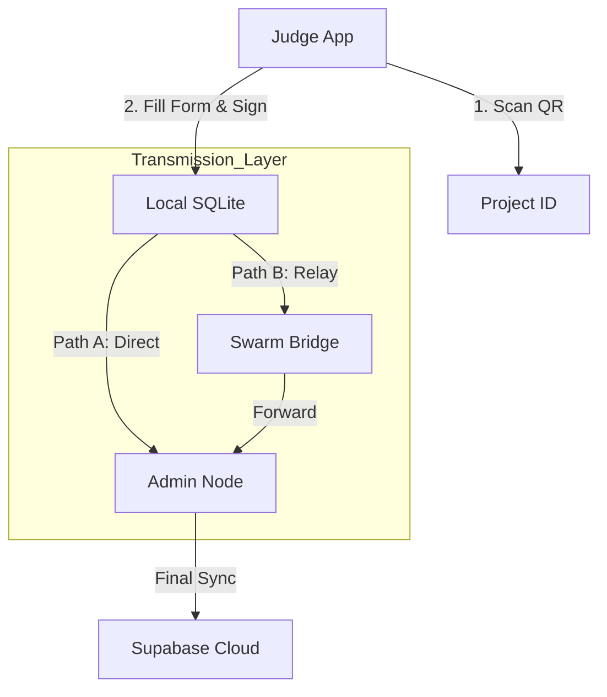

# 01. Architecture & Vision

> **Status:** Draft / Active
> **Version:** 1.0
> **Target Framework:** .NET 10 MAUI

## 1. Executive Summary

**Nodus** is a decentralized, offline-first evaluation system designed for high-density environments (auditoriums, convention centers) where internet connectivity is unreliable or non-existent.

Unlike traditional event apps that depend on a constant cloud connection or a stable local Wi-Fi, Nodus uses a **Hybrid Bluetooth LE (BLE)** approach. It combines a "Star Topology" (Direct connection) with an "Opportunistic Swarm" (Relay nodes) to ensure voting data always reaches the central server, regardless of physical obstructions or RF interference.

## 2. Core Constraints (The "Physics of the Room")

We design for the worst-case scenario, not the best.

1.  **RF Noise:** 2.4GHz spectrum is saturated by hundreds of personal devices.
2.  **Line of Sight:** Bodies (bags of water) block low-power BLE signals.
3.  **Battery Drain:** Constant scanning/broadcasting kills batteries in <45 mins.
4.  **No Internet:** The system must function 100% offline after the initial sync.

## 3. The Solution: "Store, Forward, & Swarm"

To overcome these constraints, Nodus implements a three-tier architecture:

1.  **Tier 1 (Direct):** Judge -> Admin Server. (Ideal path).
2.  **Tier 2 (Swarm Relay):** Judge -> Bridge Node -> Admin Server. (Fallback).
3.  **Tier 3 (Mule):** Judge saves data locally -> Walks to Server -> Auto-Sync. (Disaster recovery).

## 4. System Roles & Actors

### A. The Admin Node (The "Brain")

- **Device:** Windows Laptop (Surface/Dell) or High-End Android Tablet.
- **Software:** Nodus Server (.NET MAUI Desktop).
- **Responsibility:**
  - Generates the "Event QR" (System Keys + UUIDs).
  - Acts as the central GATT Server listening for votes.
  - Visualizes real-time stats.
  - Syncs to Cloud (Supabase) _only_ when wired internet is available.

### B. The Judge Node (The "Sensor")

- **Device:** Judge's Personal Phone (Android/iOS).
- **Software:** Nodus Client (.NET MAUI Mobile).
- **Responsibility:**
  - Scans "Project QRs" to open evaluation forms.
  - Captures data (Scores, Text, Audio, Photos).
  - **Encrypts & Signs** payloads.
  - Attempts to offload data via Tier 1, 2, or 3.

### C. The Project Node (The "Target")

- **Device:** Student/Presenter's Phone or Printed QR Card.
- **Responsibility:**
  - Passive Identity.
  - Does _not_ maintain active BLE connections (to save spectrum).

## 5. Architectural Diagram (Logical)

