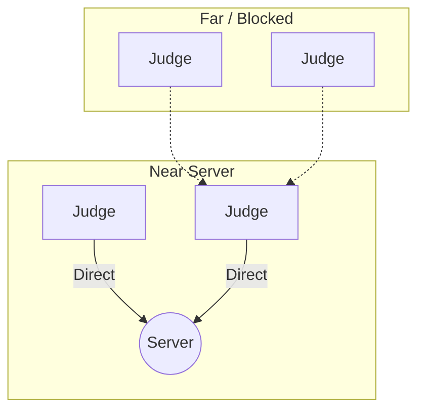

# 01. Architecture & Vision

> **Status:** Draft / Active
> **Version:** 1.1 (Firefly Update)
> **Target Framework:** .NET 10 MAUI

## 1. Executive Summary

**Nodus** is a decentralized, offline-first evaluation system designed for high-density environments.

Unlike traditional apps that fail when Wi-Fi gets congested, Nodus uses a **"Firefly" Swarm Protocol**. It turns the audience into a living, breathing network where devices dynamically wake up to bridge gaps in coverage and then sleep to save battery.

## 2. Core Constraints (The "Physics of the Room")

1.  **RF Saturation:** 500 active Bluetooth radios create a "DDoS" effect.
2.  **Battery Anxiety:** We cannot ask a user to burn 50% battery to help others.
3.  **OS Guardrails:** iOS and Android kill background processes aggressively.

## 3. The Solution: "Dynamic Swarm"

We do not have permanent "Repeaters". We have roles that rotate.

- **Protocol:** Nodes use a **probabilistic** algorithm ("Trickle") to decide if they should relay data.
- **Result:** A self-healing mesh that adapts to people moving around the room.

## 4. System Roles

### A. The Admin Node (The "Queen")

- **Device:** Windows Laptop / Tablet.
- **Role:** The target destination. The only node that _never_ sleeps.

### B. The Judge Node (The "Firefly")

- **Device:** Android/iOS Phone.
- **Role:**
  - **Observer:** Most of the time, just voting and listening.
  - **Bridge:** If well-positioned, it briefly turns into a relay to help neighbors upload their votes.

## 5. Deployment Topological View (Logical)

_J2 sees the server clearly. It becomes a **LINK** node. J3 and J4 see J2, so they hand off their packets to J2. After 1 minute, J2 gets tired, and J1 takes over._
