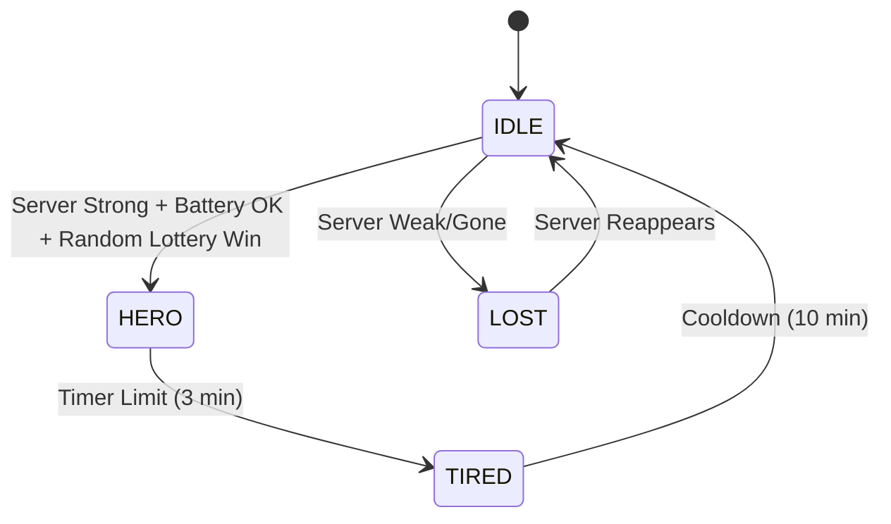

# 02. Network: The Nodus Swarm Protocol

> **Status:** Draft
> **Protocol Version:** 2.0 (Hybrid Relay)

## 1. Topologies

Nodus does not use a standard non-deterministic Mesh. It uses a **Managed Opportunistic Relay** system aka "The Swarm".

### A. Modes of Operation

1.  **Direct Mode (Default):** Client connects directly to Server GATT.
2.  **Relay Mode (Fallback):** Client connects to a visible "Bridge Node", drops the payload, and disconnects.
3.  **Mule Mode (Last Resort):** Client stores data, physically moves to Server range, and syncs.

---

## 2. The "Hero" State Machine (Finite State Machine)

Every Nodus Client (Judge/Student App) runs this FSM to decide if it should help the network.

**States:**

1.  `IDLE`: Passive scanning. Default state.
2.  `LOST`: Cannot see Server. Actively looking for a Bridge.
3.  `HERO`: Visible to Server (> -70dBm). Advertising as a Bridge.
4.  `TIRED`: Cooldown period after being a Hero.



### Logic Rules (C# Implementation Guide)

#### 1. The Suitability Score (0-100)

Calculated every 60 seconds by nodes in `IDLE` state seeing the server.

```csharp
int CalculateHeroScore() {
    if (Battery < 0.20) return 0; // Survival Rule
    if (ServerRSSI < -75) return 0; // Reliability Rule
    if (IsIOS) return 0; // OS Limitation Rule (Android prefers Bridging)

    return (BatteryLevel * 50) + (Normalize(ServerRSSI) * 50);
}
```

#### 2. The Lottery

If `Score > 80`, the node rolls a 20-sided die. `if (Random(1, 20) == 1) -> BecomeHERO()`.
_Why?_ Prevents 50 phones from blasting advertisements simultaneously near the server.

---

## 3. Packet Structure & Routing

To support "Store & Forward" without loops, we use a strict Envelope schema.

### JSON Envelope (The "Cargo")

Max MTU varies, so we assume **Chunking** is handled by the BLE Transport layer (Shiny.NET).

```json
{
  "packet_id": "GUID-V4-UNIQUE",
  "type": "VOTE_SUBMISSION",
  "origin_device_id": "DEVICE_ID_OF_JUDGE",
  "target": "SERVER_MAIN",
  "ttl": 2, // Time to live (Max Hops)
  "hops": [], // Audit trail of relayers
  "created_at_utc": "2026-10-15T10:00:00Z",
  "payload_encrypted": "BASE64_STRING_AES_256"
}
```

### Routing Rules

1.  **TTL Decrement:** A Bridge receiving a packet with `ttl: 1` sets it to `0` and accepts it. A Bridge receiving `ttl: 0` **rejects** it (prevents infinite loops).
2.  **No Echo:** A Bridge checks `packet_id` against a local Bloom Filter or LRU Cache. If seen recently, **drop silently**.

---

## 4. Advertising & Discovery

### GATT Service UUIDs

- `SERVICE_NODUS_MAIN`: `0000-1111-...` (Advertised by Admin Laptop & HERO Nodes).
- `CHAR_WRITE_VOTE`: Write-Without-Response (For speed).

### Advertisement Data

Hero Nodes must indicate they are relays, not the main server.

- **Manufacturer Data (2 bytes):**
  - `0x01` = Main Server.
  - `0x02` = Hero Bridge (Relay).

_This allows Clients in `LOST` state to prefer the Main Server if visible, and only fallback to Bridge `0x02` if necessary._
