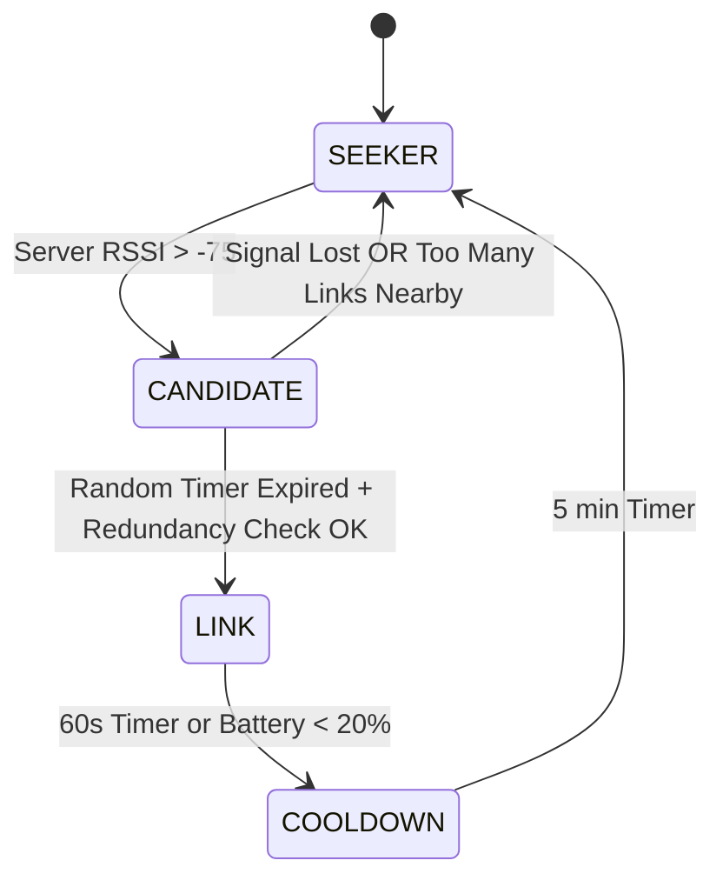

# 02. Network: The Nodus Swarm Protocol

> **Status:** Active (Firefly / Dynamic Swarm)
> **Protocol Version:** 3.0 "Firefly"
> **Core Algorithm:** Randomized Logic + Trickle-based Flooding

## 1. Topologies: The "Breathing Mesh"

Nodus uses a **Dynamic Opportunistic Swarm** (aka "Firefly Protocol"). There are no fixed "Bridge" nodes.
Every node is a potential relay, but only for short bursts and only if it helps the swarm.

### Why "Firefly"?

Like fireflies synchronized in a forest, nodes "light up" (Advertise) briefly to carry data, then "go dark" (Scan) to save energy and reduce noise.

---

## 2. The "Firefly" State Machine (FSM)

Every Nodus Client runs this loop every 1-5 seconds.

### A. The States

1.  **SEEKER (Default):**
    - **Behavior:** Scanning only. Silent.
    - **Goal:** Find the Server or a Link.
2.  **CANDIDATE:**
    - **Trigger:** Sees Server with strong signal (RSSI > -75dBm).
    - **Behavior:** Waits a random `t` interval (Trickle Logic).
    - **Goal:** Check if becoming a Link is necessary.
3.  **LINK (Hero):**
    - **Trigger:** Timer expired & still good signal & Traffic is low.
    - **Behavior:** ADVERTISING as a Server Proxy. Relays packets.
    - **Duration:** Max 60 seconds (Time-to-Live for the role).
4.  **COOLDOWN:**
    - **Trigger:** Link usage finished.
    - **Behavior:** Banned from being a Link for 5 minutes.
    - **Goal:** Force rotation to other devices (Load Balancing).



---

## 3. Optimization: The "Trickle" Algorithm

To prevent "Broadcast Storms" (50 nodes turning on at once), we use a simplified Trickle Algorithm.

### Rules of Engagement

1.  **Redundancy Constant (`k`):**
    - A Candidate listens. If it hears `>= 2` other LINK nodes advertising nearby (`RSSI > -80`), it **cancels** its own promotion.
    - _Why?_ Two bridges are enough. Three is a crowd.

2.  **Random Wait (`t`):**
    - Upon becoming a Candidate, pick `t` between `low_interval` (2s) and `high_interval` (10s).
    - This desynchronizes devices so they don't all collide.

### iOS Constraint (The "Foreground" Rule)

- **iOS Devices:** Can only be in **LINK** state if the App is **OPEN and FOREGROUND**.
- **Android Devices:** Can be **LINK** in background (with Sticky Notification).

---

## 4. Packet Structure & Routing

### JSON Envelope

```json
{
  "packet_id": "GUID-V4",
  "hops": ["JudgeA", "LinkB"],
  "payload": "ENCRYPTED_BLOB",
  "ttl": 2 // Max Hops hardcoded to 2 to prevent loops
}
```

### The "Loop" Defense

1.  **Max TTL:** A packet dies after 2 hops. (Judge -> Link -> Server).
2.  **Bloom Filter:** Nodes remember `packet_id` for 10 mins. Duplicates are dropped silently.

---

## 5. Advertising Data (The "Pheromone")

Nodes in **LINK** mode modify their Advertisement Data to signal their utility.

- **Service UUID:** `NODUS_MAIN_SERVICE`
- **Manufacturer Data (Byte 0):** `0x02` (I am a Relay).
- **Manufacturer Data (Byte 1):** `0x50` (Battery Level 80%).

_Seekers prefer Links with higher Battery levels._
