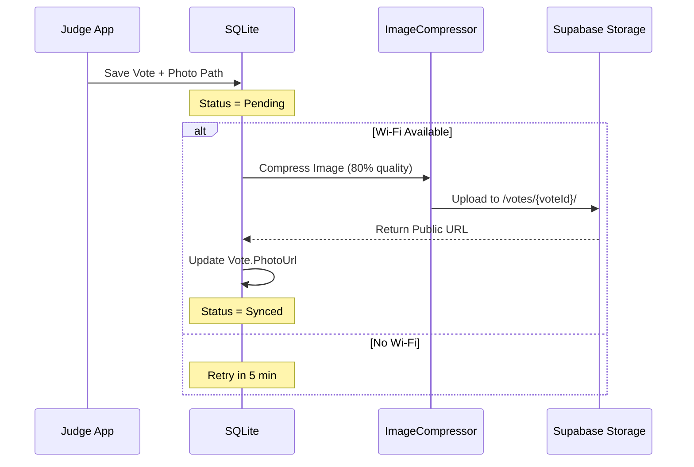

# 17. Architecture: Development Roadmap

> **Status:** Active Planning
> **Date:** 2026-02-08
> **Priority:** High
> **Estimated Time:** 3-4 weeks

## 🎯 Objetivo

Completar el desarrollo de las 4 aplicaciones del ecosistema Nodus, enfocándonos en:

1. **Nodus.Web** - Portal de estudiantes (prioridad alta)
2. **Media Sync** - Sincronización de multimedia
3. **Testing** - Cobertura de pruebas
4. **Observabilidad** - Dashboards y telemetría

---

## 📋 Fase 1: Nodus.Web - Student Portal (Prioridad 1)

### 1.1 Estado Actual

```
Nodus.Web/
├── App.razor              # ✅ Configuración básica
├── Program.cs             # ✅ Setup básico
├── Pages/                 # 🟡 Páginas básicas
│   ├── Home.razor
│   ├── Register.razor     # ❌ No implementado
│   └── Display.razor      # ❌ No implementado
└── wwwroot/               # ✅ Assets estáticos
```

### 1.2 Features a Implementar

#### A. Registro de Proyectos

**Ruta:** `/register?event={eventId}`

**Funcionalidad:**

1. Formulario de registro con campos:
   - Nombre del proyecto
   - Categoría (Software/Hardware/Innovación)
   - Descripción breve
   - Nombres de integrantes
   - GitHub URL (opcional)

2. Backend:
   - Validación de datos
   - Generación de ID único: `PROJ-{RANDOM_3_CHARS}`
   - Almacenamiento en SQLite local
   - Sync con Supabase (cuando hay conectividad)

**Archivos a crear:**

```
Nodus.Web/
├── Pages/
│   └── RegisterProject.razor
├── ViewModels/
│   └── RegisterProjectViewModel.cs
├── Services/
│   ├── ProjectService.cs
│   └── QrGeneratorService.cs
└── Models/
    └── ProjectRegistrationDto.cs
```

#### B. Display de Stand Number

**Ruta:** `/display/{projectId}`

**Funcionalidad:**

1. Pantalla completa con:
   - QR Code grande (300x300px)
   - Código del proyecto (ej: "PROJ-ABC")
   - Nombre del proyecto
   - Categoría

2. QR Code contiene:

   ```
   nodus://vote?pid=PROJ-ABC&cat=SOFTWARE
   ```

3. Auto-refresh cada 30s (para mantener pantalla activa)

**Archivos a crear:**

```
Nodus.Web/
├── Pages/
│   └── ProjectDisplay.razor
├── Components/
│   ├── QrCodeDisplay.razor
│   └── ProjectInfo.razor
└── wwwroot/
    └── css/
        └── display.css  # Fullscreen styles
```

#### C. API de Sincronización

**Endpoints:**

```csharp
// Nodus.Web/Controllers/ProjectController.cs
[ApiController]
[Route("api/projects")]
public class ProjectController : ControllerBase
{
    [HttpPost]
    public async Task<IActionResult> RegisterProject([FromBody] ProjectDto dto)

    [HttpGet("{id}")]
    public async Task<IActionResult> GetProject(string id)

    [HttpGet("event/{eventId}")]
    public async Task<IActionResult> GetEventProjects(string eventId)
}
```

### 1.3 Implementación Técnica

#### Dependencias a Agregar

```xml
<!-- Nodus.Web.csproj -->
<ItemGroup>
  <PackageReference Include="QRCoder" Version="1.6.0" />
  <PackageReference Include="Blazored.LocalStorage" Version="4.5.0" />
  <PackageReference Include="Microsoft.AspNetCore.Components.WebAssembly" Version="10.0.0" />
</ItemGroup>
```

#### Service Registration

```csharp
// Program.cs
builder.Services.AddScoped<ProjectService>();
builder.Services.AddScoped<QrGeneratorService>();
builder.Services.AddBlazoredLocalStorage();
```

---

## 📋 Fase 2: Media Sync Service (Prioridad 2)

### 2.1 Arquitectura

```
Nodus.Client/
└── Services/
    ├── MediaSyncService.cs       # Orquestador principal
    ├── ImageCompressionService.cs # Compresión con SkiaSharp
    └── SupabaseStorageService.cs  # Upload a Supabase
```

### 2.2 Flujo de Trabajo



### 2.3 Implementación

#### A. MediaSyncService

```csharp
public class MediaSyncService
{
    private readonly IDatabaseService _db;
    private readonly ImageCompressionService _compressor;
    private readonly SupabaseStorageService _storage;
    private readonly ILogger<MediaSyncService> _logger;

    public async Task SyncPendingMediaAsync(CancellationToken ct)
    {
        var pendingVotes = await _db.GetVotesWithPendingMediaAsync();

        foreach (var vote in pendingVotes)
        {
            try
            {
                if (!string.IsNullOrEmpty(vote.LocalPhotoPath))
                {
                    var compressed = await _compressor.CompressAsync(
                        vote.LocalPhotoPath,
                        quality: 80
                    );

                    var url = await _storage.UploadAsync(
                        bucket: "vote-photos",
                        path: $"{vote.EventId}/{vote.Id}.jpg",
                        data: compressed
                    );

                    vote.PhotoUrl = url;
                    vote.MediaSyncStatus = SyncStatus.Synced;
                    await _db.UpdateVoteAsync(vote);
                }
            }
            catch (Exception ex)
            {
                _logger.LogError(ex, "Failed to sync media for vote {VoteId}", vote.Id);
                vote.MediaSyncStatus = SyncStatus.SyncError;
                await _db.UpdateVoteAsync(vote);
            }
        }
    }
}
```

#### B. Background Job

```csharp
// MauiProgram.cs
builder.Services.AddSingleton<MediaSyncService>();

// App.xaml.cs
public partial class App : Application
{
    private readonly MediaSyncService _mediaSync;
    private CancellationTokenSource _cts;

    protected override async void OnStart()
    {
        base.OnStart();
        _cts = new CancellationTokenSource();

        // Start background sync every 5 minutes
        _ = Task.Run(async () =>
        {
            while (!_cts.Token.IsCancellationRequested)
            {
                if (Connectivity.NetworkAccess == NetworkAccess.Internet)
                {
                    await _mediaSync.SyncPendingMediaAsync(_cts.Token);
                }
                await Task.Delay(TimeSpan.FromMinutes(5), _cts.Token);
            }
        });
    }
}
```

### 2.4 Modelo de Datos Actualizado

```csharp
// Nodus.Shared/Models/Vote.cs
public class Vote
{
    // ... campos existentes ...

    // Media fields
    public string? LocalPhotoPath { get; set; }
    public string? PhotoUrl { get; set; }
    public string? LocalAudioPath { get; set; }
    public string? AudioUrl { get; set; }

    // Separate sync status for media
    public SyncStatus MediaSyncStatus { get; set; } = SyncStatus.Pending;
}
```

---

## 📋 Fase 3: Testing Infrastructure (Prioridad 3)

### 3.1 Estructura de Tests

```
tests/
├── Nodus.Tests.Unit/
│   ├── Services/
│   │   ├── CryptoHelperTests.cs
│   │   ├── PacketTrackerTests.cs
│   │   └── ChunkAssemblerTests.cs
│   └── Protocol/
│       └── NodusPacketTests.cs
├── Nodus.Tests.Integration/
│   ├── BLE/
│   │   ├── BleClientServiceTests.cs
│   │   └── BleServerServiceTests.cs
│   └── Database/
│       └── DatabaseServiceTests.cs
└── Nodus.Tests.Simulation/
    └── SwarmSimulationTests.cs
```

### 3.2 Unit Tests Críticos

#### A. CryptoHelper Tests

```csharp
public class CryptoHelperTests
{
    [Fact]
    public void Encrypt_Decrypt_RoundTrip_Success()
    {
        // Arrange
        var key = CryptoHelper.GenerateAesKey();
        var plaintext = "Test Vote Data";

        // Act
        var encrypted = CryptoHelper.Encrypt(
            Encoding.UTF8.GetBytes(plaintext),
            key
        );
        var decrypted = CryptoHelper.Decrypt(encrypted, key);
        var result = Encoding.UTF8.GetString(decrypted);

        // Assert
        Assert.Equal(plaintext, result);
    }

    [Fact]
    public void Sign_Verify_ValidSignature_Success()
    {
        // Arrange
        var (publicKey, privateKey) = CryptoHelper.GenerateKeyPair();
        var message = "Vote Payload";

        // Act
        var signature = CryptoHelper.Sign(
            Encoding.UTF8.GetBytes(message),
            privateKey
        );
        var isValid = CryptoHelper.Verify(
            Encoding.UTF8.GetBytes(message),
            signature,
            publicKey
        );

        // Assert
        Assert.True(isValid);
    }
}
```

#### B. PacketTracker Tests

```csharp
public class PacketTrackerTests
{
    [Fact]
    public void HasSeen_NewPacket_ReturnsFalse()
    {
        // Arrange
        var tracker = new PacketTracker();
        var packetId = Guid.NewGuid().ToString();

        // Act
        var result = tracker.HasSeen(packetId);

        // Assert
        Assert.False(result);
    }

    [Fact]
    public void HasSeen_DuplicatePacket_ReturnsTrue()
    {
        // Arrange
        var tracker = new PacketTracker();
        var packetId = Guid.NewGuid().ToString();

        // Act
        tracker.MarkAsSeen(packetId);
        var result = tracker.HasSeen(packetId);

        // Assert
        Assert.True(result);
    }
}
```

### 3.3 Integration Tests

#### BLE Service Tests (Mock-based)

```csharp
public class BleClientServiceTests
{
    [Fact]
    public async Task ConnectAsync_ValidPeripheral_Success()
    {
        // Arrange
        var mockBleManager = new Mock<IBleManager>();
        var service = new BleClientService(
            mockBleManager.Object,
            Mock.Of<ILogger<BleClientService>>()
        );

        // Act
        var result = await service.ConnectAsync(
            peripheralId: "test-peripheral",
            timeout: TimeSpan.FromSeconds(5),
            ct: CancellationToken.None
        );

        // Assert
        Assert.True(result);
    }
}
```

---

## 📋 Fase 4: Observabilidad y Telemetría (Prioridad 4)

### 4.1 Dashboard de Topología en Tiempo Real

**Objetivo:** Visualizar la red mesh en vivo desde el Admin Dashboard.

#### A. Modelo de Datos

```csharp
// Nodus.Shared/Models/NetworkNode.cs
public class NetworkNode
{
    public string Id { get; set; }
    public NodeRole Role { get; set; }  // Server/Link/Seeker
    public int Rssi { get; set; }
    public int BatteryLevel { get; set; }
    public DateTime LastSeen { get; set; }
    public List<string> ConnectedTo { get; set; }
}

public enum NodeRole
{
    Server,
    Link,
    Seeker,
    Offline
}
```

#### B. Service de Telemetría

```csharp
// Nodus.Server/Services/NetworkTelemetryService.cs
public class NetworkTelemetryService
{
    private readonly ConcurrentDictionary<string, NetworkNode> _nodes = new();

    public void UpdateNode(string nodeId, NodeRole role, int rssi, int battery)
    {
        _nodes.AddOrUpdate(nodeId,
            new NetworkNode
            {
                Id = nodeId,
                Role = role,
                Rssi = rssi,
                BatteryLevel = battery,
                LastSeen = DateTime.UtcNow
            },
            (key, existing) =>
            {
                existing.Role = role;
                existing.Rssi = rssi;
                existing.BatteryLevel = battery;
                existing.LastSeen = DateTime.UtcNow;
                return existing;
            }
        );
    }

    public List<NetworkNode> GetActiveNodes()
    {
        var cutoff = DateTime.UtcNow.AddMinutes(-2);
        return _nodes.Values
            .Where(n => n.LastSeen > cutoff)
            .ToList();
    }
}
```

#### C. UI Component (MAUI)

```xml
<!-- Nodus.Server/Views/TopologyPage.xaml -->
<ContentPage>
    <Grid>
        <GraphicsView Drawable="{Binding NetworkGraph}" />

        <CollectionView ItemsSource="{Binding ActiveNodes}">
            <CollectionView.ItemTemplate>
                <DataTemplate>
                    <Grid Padding="10">
                        <Label Text="{Binding Id}" FontSize="14" />
                        <Label Text="{Binding Role}" FontSize="12" />
                        <ProgressBar Progress="{Binding BatteryLevel}" />
                    </Grid>
                </DataTemplate>
            </CollectionView.ItemTemplate>
        </CollectionView>
    </Grid>
</ContentPage>
```

### 4.2 Métricas de Red

#### A. Packet Loss Tracking

```csharp
public class NetworkMetrics
{
    public int PacketsSent { get; set; }
    public int PacketsReceived { get; set; }
    public int PacketsDropped { get; set; }

    public double PacketLossRate =>
        PacketsSent > 0
            ? (double)PacketsDropped / PacketsSent
            : 0;

    public TimeSpan AverageLatency { get; set; }
    public int ActiveLinks { get; set; }
}
```

#### B. Dashboard de Métricas

```csharp
// Nodus.Server/ViewModels/ResultsViewModel.cs
public partial class ResultsViewModel : ObservableObject
{
    [ObservableProperty]
    private NetworkMetrics _metrics;

    [ObservableProperty]
    private int _totalVotes;

    [ObservableProperty]
    private int _pendingVotes;

    [RelayCommand]
    private async Task RefreshMetrics()
    {
        Metrics = await _telemetryService.GetMetricsAsync();
        TotalVotes = await _db.GetVoteCountAsync();
        PendingVotes = await _db.GetPendingVoteCountAsync();
    }
}
```

---

## 🗓️ Timeline Estimado

### Semana 1: Nodus.Web

- **Días 1-2:** Registro de proyectos
- **Días 3-4:** Display de QR
- **Día 5:** API y sincronización

### Semana 2: Media Sync

- **Días 1-2:** ImageCompressionService
- **Días 3-4:** SupabaseStorageService
- **Día 5:** Background job y testing

### Semana 3: Testing

- **Días 1-2:** Unit tests
- **Días 3-4:** Integration tests
- **Día 5:** Simulación de swarm

### Semana 4: Observabilidad

- **Días 1-3:** Dashboard de topología
- **Días 4-5:** Métricas y telemetría

---

## 📊 Criterios de Éxito

### Nodus.Web

- ✅ Estudiante puede registrar proyecto en < 2 min
- ✅ QR code se genera correctamente
- ✅ Display funciona en modo fullscreen
- ✅ Sync con Supabase funciona

### Media Sync

- ✅ Fotos se comprimen a < 500KB
- ✅ Upload exitoso a Supabase
- ✅ Background job no drena batería (< 5% por hora)

### Testing

- ✅ Cobertura de código > 70%
- ✅ Todos los tests críticos pasan
- ✅ Simulación con 10+ dispositivos exitosa

### Observabilidad

- ✅ Dashboard muestra topología en tiempo real
- ✅ Métricas se actualizan cada 5s
- ✅ Alertas de batería baja funcionan

---

## 🚀 Próximos Pasos Inmediatos

1. **Crear estructura de Nodus.Web:**

   ```bash
   cd src/Nodus.Web
   mkdir Pages/Register Pages/Display
   mkdir ViewModels Services
   ```

2. **Instalar dependencias:**

   ```bash
   dotnet add package QRCoder
   dotnet add package Blazored.LocalStorage
   ```

3. **Implementar RegisterProject.razor**

4. **Implementar ProjectDisplay.razor**

5. **Testing manual con dispositivo real**

---

**Última actualización:** 2026-02-08
**Versión:** 1.0
**Estado:** Ready for Implementation
